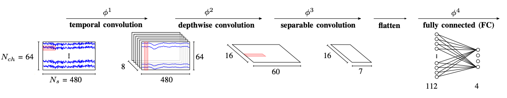

# EEGNet-for-low-power-edge-computing
[Unofficial] Implementation of the paper An Accurate EEGNet-based Motor-Imagery Brain-Computer Interface for Low-Power Edge Computing by Xiaying Wang et.al

The proposed novel model, based on EEGNet, matches the requirements of memory footprint and computational resources of low-power microcontroller units (MCUs), such as the ARM Cortex-M family. The architecture integrates temporal downsampling, channel selection, and classification window narrowing to further reduce memory requirements with negligible accuracy degradation.

The authors scaled down the standard EEGNet, achieving a reduction of the memory footprint by 7.6 times with a negligible accuracy loss of 0.31%, and a 15 times footprint reduction with an accuracy drop of just 2.51%. This memory footprint reduction allowed for an autonomous, wearable, and accurate low-power BCI.

 

> The scaled models are deployed on a commercial Cortex-M4F MCU taking 101 ms and consuming 4.28 mJ per inference for operating the smallest model, and on a Cortex-M7 with 44 ms and 18.1 mJ per inference for the mediumsized model

   

# Architecture

 Standard configuration for 4-class MI on the Physionet Motor Movement/Imagery dataset. A window of 3 s (Ns = 480 samples) with
Nch = 64 channels is classified at the time.
 Source: original publication.

 
The model reduces the memory footprint through techniques such as temporal downsampling, channel selection, and narrowing the classification window, while maintaining high classification accuracy. This architecture enables real-time, low-power MI classification suitable for wearable and embedded systems.

   

# Results

<small>

|                | Standard | Downsampling (ds=2) | Downsampling (ds=3) | Channel reduction (Nch=38) | Channel reduction (Nch=19) | Channel reduction (Nch=8) | Time window (T=2 s) | Time window (T=1 s) |
|----------------|----------|---------------------|---------------------|--------------------------------------|---------------------------------------|-------------------------------|------------------------|-----------------------|
| **2 classes**  | 82.43    | 82.11               | 81.97               | 81.86                                | 81.95                                 | 78.07                         | 81.11                  | 79.86                 |
| **3 classes**  | 75.07    | 74.78               | 73.82               | 74.12                                | 72.41                                 | 68.99                         | 73.45                  | 71.47                 |
| **4 classes**  | 65.07    | 64.81               | 64.77               | 64.65                                | 62.55                                 | 58.55                         | 64.13                  | 63.51                 |

</small>
Classification accuracy (%) using global validation.  
Source: original publication.

  

<small>

|                       | Model 1   |           |           | Model 2   |
|-----------------------|-----------|-----------|-----------|-----------|
| **MACC**              | 761,956   |           |           | 1,509,220 |
| **ROM size [KB]**     | 6.61      |           |           | 7.12      |
| **RAM size [KB]**     | 70.27     |           |           | 139.20    |
|                       | **M4F**   | **M7**    | **M7**    | **M7**    |
|                       | **@80 MHz**| **@80 MHz**| **@216 MHz**| **@216 MHz** |
| **Cycles/MACC**       | 10.59     | 5.77      | 5.78      | 6.27      |
| **Power [mW] @ 3.3V** | 42.44     | 131.41    | 412.76    | 413.06    |
| **T/inference [ms]**  | 100.84    | 54.99     | 20.40     | 43.81     |
| **En./inference [mJ]**| 4.28      | 7.23      | 8.42      | 18.1      |

</small>

"ARM Cortex-M4F vs. M7 on 4-class MI. Both Model 1 (62.51% accuracy)
and Model 2 (64.76%) use a downsampling of ds=3 and Nch=38 channels,
the former has time window T=1 s, while the latter T=2 s."
  
Source: original publication.

